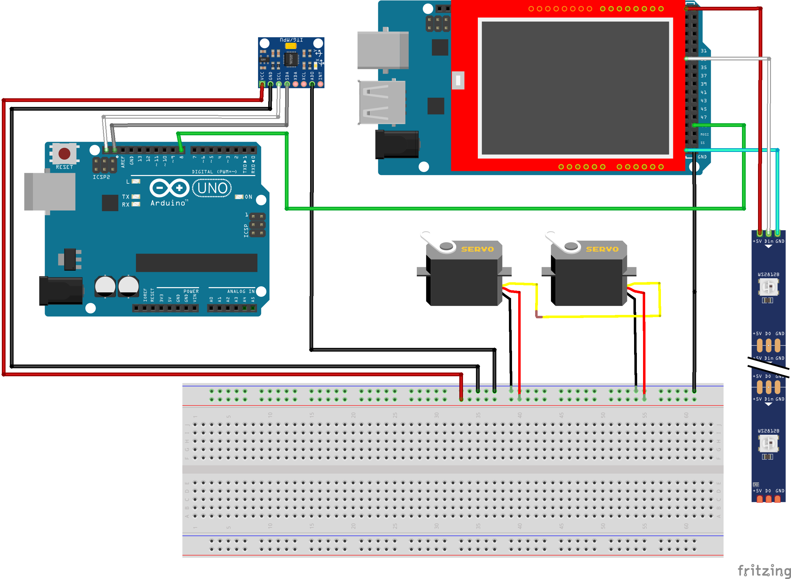

# Projeto Labirinto PacMan

ENG4033 — Projeto Programação de Microcontroladores
Feito por: Eskil Solland, Mael Cheynet, Maria Isabel Nicolau, Thadeu Cavalcanti

## Introdução

O **Projeto Labirinto PacMan** tem como objetivo transformar o clássico jogo Pac-Man em uma experiência **física e interativa**. Trazendo o jogo para o mundo real, o projeto integra **eletrônica, programação, mecânica e visão computacional** para recriar o desafio do labirinto, controlado de forma inovadora e imersiva.

O sistema foi desenvolvido com base em três vertentes principais:  
- a **lógica do jogo**,  
- o **monitoramento do movimento da bolinha (Pac-Man)**  
- e a **movimentação física do labirinto**.  

Como descrito a seguir, estão destacados os respectivos componentes e suas funções no funcionamento geral do projeto.

---

## 1. Lógica do Jogo

Esta vertente é responsável por **gerenciar a estrutura visual do jogo** e o controle dos elementos estáticos da interface.

**Componentes utilizados:**
- Arduino Mega  
- Tira de LEDs endereçáveis (total de 86 LEDs)  
- Tela Shield TFT  

**Função:**  
O Arduino Mega é responsável por controlar os LEDs, que representam os **pontos (amarelos)**, **frutas (azuis)** e **fantasmas (rosa/ciano/laranja/vermelho)** no tabuleiro.  
A lógica implementada define quais LEDs devem estar acesos ou apagados conforme o progresso da bolinha, com suporte visual adicional exibido no Shield TFT.

---

## 2. Monitoramento

A parte de monitoramento cuida da **detecção da posição da bolinha (Pac-Man)** no labirinto, permitindo que o sistema saiba onde ela está em tempo real.

**Componentes utilizados:**
- Câmera com OpenCV  
- Tripé de apoio  

**Função:**  
A câmera, posicionada acima do labirinto com o auxílio de um tripé, **captura em tempo real a movimentação da bolinha**. Utilizando a biblioteca OpenCV, a imagem é processada para **identificar a posição da bolinha no espaço**, fornecendo dados essenciais para a atualização da lógica do jogo e dos LEDs.

---

## 3. Movimentação do Labirinto

Esta parte do sistema permite ao jogador **controlar a inclinação do tabuleiro**, simulando o movimento do Pac-Man através da movimentação física da bolinha.

**Componentes utilizados:**
- Acelerômetro  
- Segundo Arduino Mega  
- 2 servomotores  
- Estrutura de suporte: peças impressas em 3D, tábua de madeira, labirinto superior impresso e bolinha  

**Função:**  
O jogador utiliza um controle com **acelerômetro**, que envia os dados de inclinação para o **segundo Arduino Mega**. Este, por sua vez, aciona dois **servomotores** que inclinam o tabuleiro em dois eixos, movimentando a bolinha de acordo com os gestos do jogador.  
A estrutura é composta por uma base de madeira com os LEDs, sobre a qual está fixado o labirinto impresso em 3D.

---

## Material de Apoio

Para melhor compreensão do funcionamento e da integração entre as três vertentes do projeto, será disponibilizado um **vídeo demonstrativo**, no qual apresentamos o sistema em funcionamento, destacando os principais mecanismos implementados.
📎 _[(https://www.youtube.com/watch?v=202jqDJVHeo)]_

Além disso, elaboramos um diagrama esquemático com todas as conexões utilizadas, ilustrando a arquitetura do sistema:

